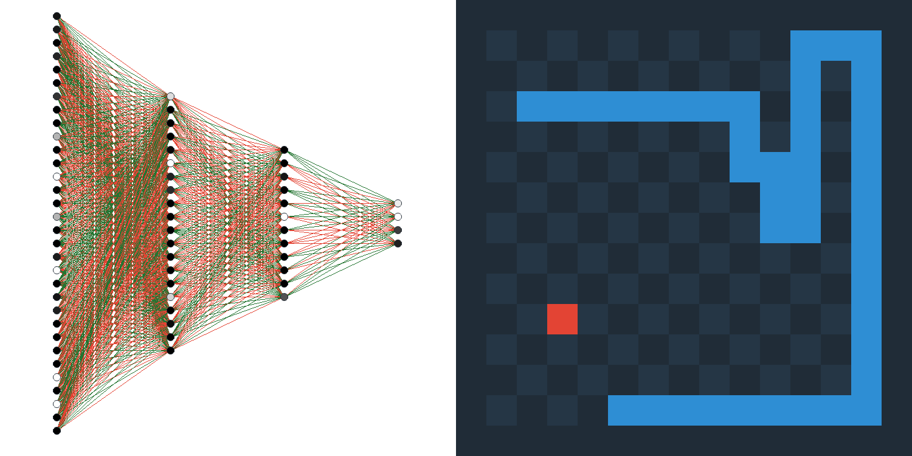

  
[](http://arthurdujardin.com/project/snake.html)


# PySnake


**PySnake** is an artificial intelligence that learns to control a snake. This AI learns to recognize its environment and choose the best direction to survive.
This model uses Genetic Algorithm theory, as there is no training data available.
<p align="center">
  <b>PySnake Interface</b><br>
  
  <br>
</p>


The game is simple. The player / AI control a snake in four directions : UP, RIGHT, DOWN, LEFT. The goal is to eat as many apples as possible, increasing the snake's length.
The snake dies when it eats itself or crash in a wall.

### SAGA

[SAGA](https://documentation.sigma2.no/quick/saga.html) is a distributed memory system which consists of 244 dual/quad socket nodes, interconnected with a high-bandwidth low-latency InfiniBand network. The model has been trained on [SAGA](https://documentation.sigma2.no/quick/saga.html) servers with an access of 16GB ram and 8 nodes, through 3000 generations of 1500 snakes each.

## Getting Started

### Install

To install, clone this repository:

```
$ git clone https://github.com/arthurdjn/pysnake
```

Note that pysnake requires [pygame](https://www.pygame.org/news) to visualize the game.
I you installed **pysnake** through pip `pip install .`, it will automatically download all required dependencies. Otherwise, use:

```
$ pip install pygame
$ pip install numpy
$ pip install json
```

### Config

The application settings are available from the `config.ini` file. You can create a custom one, as long as you have the necessary parameters.
  

### Play

You can play and launch the application by running the following command:
```
$ python pysnake
```
This will call the `pysnake/__main__.py` file and execute your command.
If you choose to render the game, you should see a pop-up window like this:




To play the game, use :
- `UP ARROW` to move up,
- `LEFT ARROW` to move left,
- `DOWN ARROW` to move down,
- `RIGHT ARROW` to move right,
- `SPACE BAR` to pause the game,
- `r` to restart the game,
- `v` to render the snake's vision,
- `g` to display the game grid


You can turn it off with `render = False` in the `config.ini` file.


There are more key arguments that you can used to launch the application:
- `--mode`: run either a playble or trainable game,
- `--config`: read a custom config file,
- `--snake`: run a snake from a saved file. The snake will play automatically in an unseen environment,
- `--replay`: run a snake from a saved file, in the same environment it was originally saved,
- `--population`: train snakes from an existing population.


#### Examples

By default, the game mode used is `play`.
If you just want to play the game, you can explicitly use in addition the `--mode` key argument:
```
$ python pysnake --mode play
```
You can specify `--mode train` to train snakes.

If you created a custom config.ini, specify it each time you run pysnake:
```
$ python pysnake --config path/to/your/config.ini
```

Snakes and generations can be saved. Change the default parameters in the `config.ini` files.
Even though saving the best snakes for X generations depends on your needs, I recommend that you save some of your generations, in case your computer / server shuts down. Saving generations with a `saving_steps = 50` prevents you to starting the simulation from zero if something (bad) happens.

Once snakes are saved, load them with one of these commands:

```
$ python pysnake --snake pysnake/snake.json
```

```
$ python pysnake --replay pysnake/snake.json
```

```
$ python pysnake --mode train --population pysnake/saves/generation_1500
```

## Development

PySnake architecture depends on 3 elements:
- `snake's vision`,
- `neural network`,
- `genetic algorithm`.

### Vision

The snake's vision is composed of rays (lines) going from its head to the game borders. These rays are equally spaced, the range depends on the `vision_mode` parameters (goes from 1 to +infinity). The vision can be visualized as a LiDAR sensor.

<p align="center">
  <b>8-mode vision</b><br>
  
  <br>
</p>
